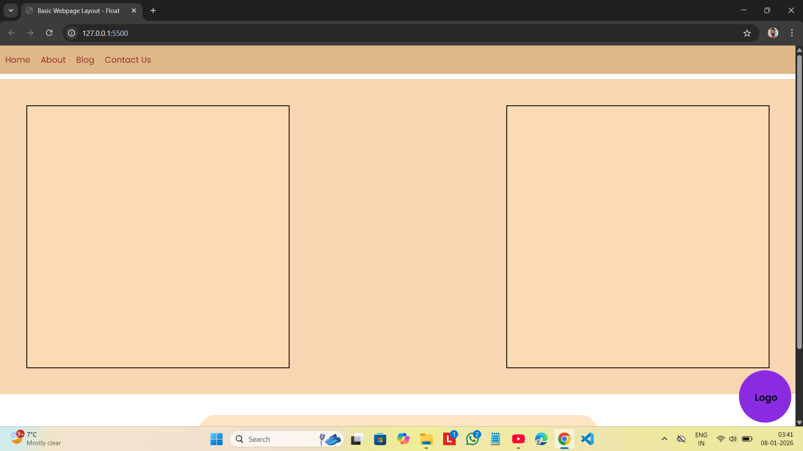
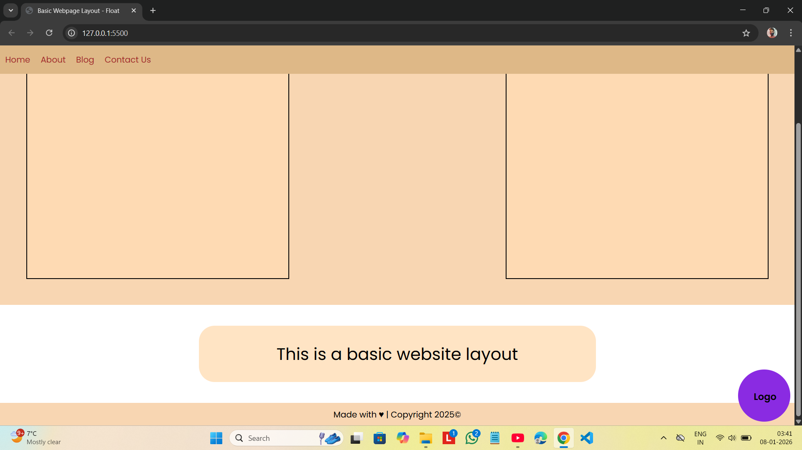

## Basic Webpage Layout

Basic webpage layout using css float property.

### Major CSS Properties used
- position
- float

### Tech Used
- HTML
- CSS

### Features
- Sticky navbar
- Fixed website logo at bottom right corner
- Use of semantic tags like `<header>` , `<footer>` , `<nav>` , `<section>`
- Use of CSS Entities for &copy; and &hearts;

## Preview

