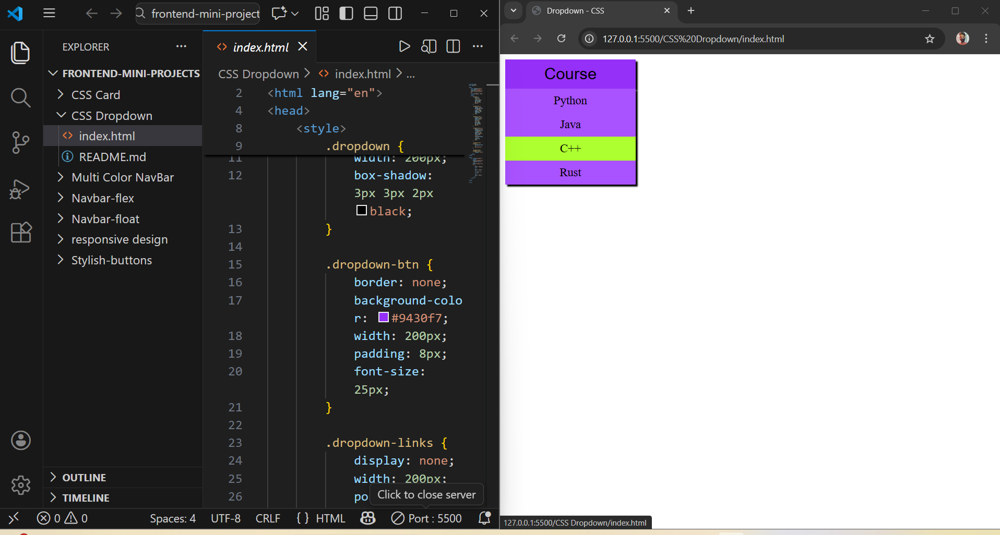

## CSS Dropdown Menu

CSS Dropdowns used to show list of options when someone hover or click to it.

### Tech Used
- HTML
- CSS

### Features
- Smooth hover effect
- Stylish shadow effect
- Easy to customize

## Preview

