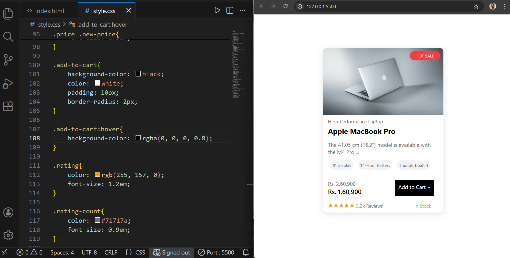

## Shopping Card UI

A simple and modern **Shopping / Product Card UI** built using **HTML and CSS**.  
This project demonstrates a clean e-commerce product card design with pricing, rating, and hover effects.

### Technologies Used

- HTML5  
- CSS3  
  - Flexbox  
  - Hover effects  
  - Box-shadow & transitions 

### Features

- Product card layout
- HOT SALE badge
- Product image with hover zoom
- Old price & discounted price
- Add to Cart button
- Star rating and review count
- Stock availability status
- Smooth hover animations

---

### Project Structure

- Shopping Card
  - index.html 
  - style.css 
  - README.md
  - macbook image.jpg 
  - screenshots
      - preview.png

---

### Preview

