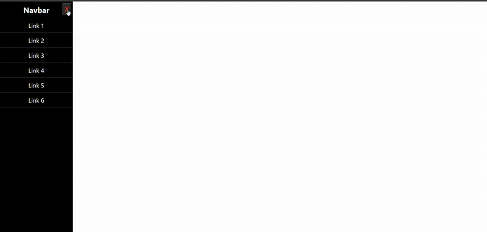

# Side Navbar UI

A simple and modern **Side Navigation Bar** built using **HTML, CSS, and JavaScript**.  
This project demonstrates how to create a smooth left-side sliding navbar with open and close functionality.

---

## Technologies Used

- **HTML5**
- **CSS3**
  - Positioning
  - Transitions
- **JavaScript**
  - DOM manipulation

---

## Features

- Smooth slide-in & slide-out animation
- Left-side fixed navigation menu
- Open & close button functionality
- Clean and minimal UI
- Beginner-friendly code structure

---

## Preview

---

## How to Run Locally

1. Download or clone the repository.
2. Make sure `index.html` , `style.css` and `lines.png` are in the same folder.
3. Open `index.html` in any modern web browser.

---

## What I Learned

- Creating a sidebar using `position: absolute`
- Using CSS `transition` for smooth animations
- Handling click events with JavaScript
- Manipulating styles using JavaScript
- Structuring a simple UI project properly

---

## Contributing

Contributions, suggestions, and improvements are welcome!

---

## License

This project is open source and free to use for learning purposes.

⭐ If you like this project, consider giving it a star!
